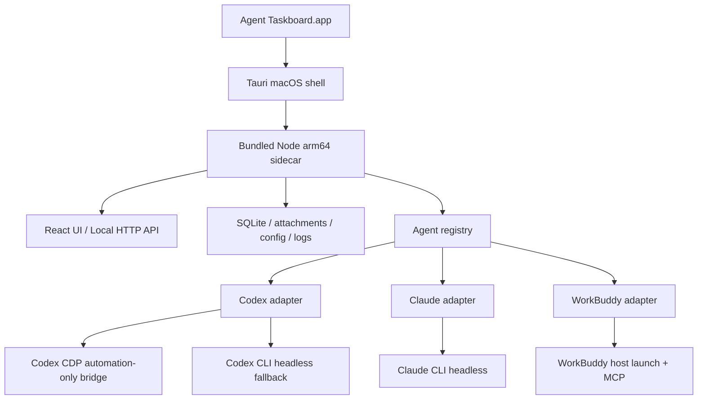

# Agent Taskboard macOS 一期实施方案

> 状态：讨论稿
> 对应任务：`7627EC6179C0-65 打包应用`
> 已有子任务：`7627EC6179C0-60 新建项目`（`in_review`）

## 1. 一期发布定义

```text
Product name: Agent Taskboard
Bundle identifier: io.github.jkj-jim.agenttaskboard
Minimum system: macOS 14.0
Architecture: Apple Silicon / arm64
Bundled runtime: Node.js 22.23.2 / arm64
Stable origin: http://127.0.0.1:47824
Beta origin: http://127.0.0.1:47825
Development origin: http://127.0.0.1:47823
Update endpoint: https://github.com/jkj-jim/agent-taskboard/releases/latest/download/latest.json
```

`tauri.conf.json` 设置 `bundle.macOS.minimumSystemVersion = "14.0"`；CI 解包产物并校验 `Info.plist` 的 `LSMinimumSystemVersion` 同为 `14.0`。

stable 与 beta 使用同一 bundle identifier，但构建时根据 App SemVer 是否包含 pre-release 标记固定为 `production` 或 `beta` profile；运行时不提供 profile 切换。beta 可替换本机 App 二进制，但只能访问独立的 beta App Data，重新安装 stable 后会回到未被 beta 改动的 production 数据。

一期交付：

- 可签名、公证和安装的 macOS arm64 App；
- 无源码仓库、无系统 Node 时可运行；
- App 内创建和管理本地项目、任务、评论和附件；
- 检测 Codex、Claude Code、WorkBuddy 的真实可用状态；
- 新任务只显示当前可启动的 Agent；
- Codex 通过 CDP 创建原生 session，不向 Codex 显示 Taskboard 面板；
- Claude Code 通过 CLI headless 执行；
- WorkBuddy 自动写入并验证 Taskboard MCP；
- production 负责在 `~/.agents/skills/manage-taskboard` 安装和手动更新默认 skill，beta 只读使用；
- 安装版与 `npm run dev` 可同时运行；
- production 通过公开 GitHub Releases 自动更新；beta 只手动下载安装。

一期不包含：

- macOS Intel / x64 安装包；
- Windows 安装包及 Windows Agent 探测；
- 开发版 `.data` 数据迁移；
- Codex 内嵌 Taskboard 面板；
- 云端多人协作改造；
- 自动覆盖用户修改过的 skill；
- 数据库迁移前备份与失败恢复（延后独立实施，见 §14 发布红线）。

## 2. 目标架构



模块边界：

| 模块 | 职责 |
| --- | --- |
| Tauri shell | 单实例、窗口、App Data、sidecar、系统文件夹选择、更新安装 |
| Node sidecar | 数据、API、Agent 状态、启动协调、session 绑定、taskctl shim |
| Agent adapter | 安装与认证探测、transport、提示词、事件解析、看板访问方式 |
| Codex automation bridge | 项目选择、原生 session、skill mention、编辑器预填/提交、session ID 捕获 |
| WorkBuddy integration | MCP 配置、宿主启动、连接验证 |

## 3. 文件与适配器边界

共享声明继续由 `shared/agents.mjs` 维护：

```js
{
  kind,
  label,
  actor,
  assigneeTarget,
  sessionEnvVar,
  capabilities: {
    headless,
    hostLaunch,
    boardAccess,
  },
}
```

Agent 规则按文件拆分：

```text
server/agents/
  codex.mjs
  claude.mjs
  workbuddy.mjs
  index.mjs
  prompt.mjs
  spawn.mjs
  taskctl-bin.mjs
  workspaces.mjs
```

Codex 宿主能力拆分为：

```text
inject/
  codex-automation.user.js
  codex-taskboard-panel.user.js

server/
  codex-desktop-controller.mjs
```

一期安装版只加载 `codex-automation.user.js`。开发命令可同时加载 automation bridge 和 panel。

约束：

- 通用 UI、API route 和共享模块不新增按 Agent 名称分支；
- Agent 专属探测、提示词和启动行为只进入对应 adapter；
- inject 不决定 transport，不读写 Taskboard 数据；
- controller 只消费 adapter 已生成的 instruction 和 runtime 参数。

## 4. macOS App 与 sidecar

新增：

```text
src-tauri/
  tauri.conf.json
  Cargo.toml
  src/
    main.rs
    paths.rs
    sidecar.rs
    window.rs
    updater.rs
  icons/
```

安装包包含：

- Node.js `22.23.2` arm64 官方二进制；
- `server/`、`shared/`、`cli/` 的纯 `.mjs` 源码；
- React 生产静态资源；
- 默认 skill 模板；
- App 图标和第三方许可证。

运行时约束：

- 安装版始终使用 App 内携带的 Node，不探测、不下载、也不调用用户系统 Node；
- `server/`、`shared/`、`cli/` 不得引入第三方运行时 npm 依赖；前端 npm 包只进入构建后的静态资源；
- `.nvmrc` 是 Node 版本单一来源，固定为 `22.23.2`；sidecar 下载脚本和 GitHub Actions 从该文件读取版本；
- `package.json#engines.node` 收窄为 `>=22.16 <23`，开发、测试和打包 CI 均在 `.nvmrc` 版本执行；
- 下载 `node-v22.23.2-darwin-arm64.tar.gz` 后校验 Node 官方 `SHASUMS256.txt`，校验通过才进入签名产物；
- P0 使用 GitHub Actions `macos-14` arm64 runner，用该二进制直接运行 `npm test`、`node:sqlite` 和 sidecar 启动测试；
- Node SEA 只保留为后续包体优化实验，一期使用“Node 二进制 + `.mjs` 源码”，不把 SEA 放入交付关键路径。

App 版本来源：

- `package.json#version` 是唯一人工维护的完整 SemVer 来源，release tag 必须与其完全一致，包括 pre-release 标记；
- 新增 `scripts/sync-app-version.mjs`：校验完整 SemVer，并从同一个值同步 `tauri.conf.json`，生成 `src-tauri/src/app_version_generated.rs` 和 `shared/app-version.generated.mjs`；CI 的 `--check` 模式在任一目标与 `package.json#version` 不一致时失败；
- Tauri 只使用生成的 Rust 常量 `APP_VERSION_FULL` 做 profile 推导和版本比较；sidecar 只使用生成的 ESM 常量 `APP_VERSION_FULL` 做启动握手和 `/health.version`；两端要求字符串完全相同；延后的迁移安全网也只能读这两个常量；
- 运行时不得从 `Info.plist`、文件名、Git tag、updater 响应或 `package.json` 现读版本；`CFBundleShortVersionString` 即使被打包工具规范化，也不参与安全判断；
- `/health.version`、启动日志和后续版本状态文件统一保存完整 SemVer；例如 `2.1.0-beta.1` 与 `2.1.0-beta.2` 必须保持可区分。

Tauri 启动 sidecar 时传入：

```text
--profile <production|beta>
--app-version <APP_VERSION_FULL>
--host 127.0.0.1
--port <profile-port>
--data-directory <profile-data>/data
--attachments-directory <profile-data>/attachments
--runtime-directory <profile-data>/runtime
--static-directory <resources>/web
--skill-path ~/.agents/skills/manage-taskboard
--taskctl-cli-path <resources>/cli/taskctl.mjs
```

sidecar 参数落点：

| CLI 参数 | 服务端落点 |
| --- | --- |
| `--profile` | `resolveServerOptions().profile`，只接受 `production` 或 `beta` |
| `--app-version` | `resolveServerOptions().appVersion`；必须与 `shared/app-version.generated.mjs` 完全一致 |
| `--host` | `listen.host`，传给 `app.listen()` |
| `--port` | `listen.port`，传给 `app.listen()` |
| `--data-directory` | `resolveServerOptions().dataDirectory` |
| `--attachments-directory` | `resolveServerOptions().attachmentsDirectory` |
| `--runtime-directory` | 新增的 `resolveServerOptions().runtimeDirectory`，存放 Codex CDP 端口等易失状态 |
| `--static-directory` | `resolveServerOptions().staticDirectory` |
| `--skill-path` | `resolveServerOptions().skillPath` |
| `--taskctl-cli-path` | 新增的 `resolveServerOptions().taskctlCliPath` |

实现要求：

- `server/index.mjs` 新增 argv 解析，将 `process.argv.slice(2)` 统一转换为 listen options 和 server options；
- sidecar 启动时先校验 `--app-version` 与自身生成常量完全相等，并校验完整版本的 pre-release 状态与 `--profile` 对应；不匹配时在打开 SQLite 前退出，避免 Tauri 与 sidecar 资源版本错配；
- CLI 参数优先级高于 `CODEX_TASKBOARD_*` 环境变量，环境变量高于开发版默认值；
- `createTaskctlRuntime()` 使用 `resolved.taskctlCliPath`，不得再直接拼接 `PROJECT_ROOT/cli/taskctl.mjs`；
- 安装版启动必须显式传入 runtime、static、skill、taskctl CLI 四个状态或资源路径；缺失时立即报错，不回退到 `PROJECT_ROOT`；
- `PROJECT_ROOT` 默认值只服务于 `npm run dev` 和测试；
- 为十个参数、profile/version 配对、优先级、缺失参数和包含空格的 App Data 路径增加启动参数契约测试。

生命周期：

- 以 `{bundleIdentifier}:{profile}` 作为单实例键；同一 profile 只运行一个 App 实例，production、beta 和开发服务不互相前置窗口；
- `/health` 返回 `{ status, appId, profile, version, pid, instanceId }`，确认 `appId`、期望 profile 和版本均匹配后才加载主窗口；
- production 固定使用 47824，beta 固定使用 47825；端口被同 profile 实例占用时由单实例通道前置已有窗口，被其他进程或其他 profile 占用时停止启动且不改用随机端口；只有 `/health` 能识别身份时才显示占用者信息，否则只提示对应端口冲突；
- sidecar 异常退出最多重启 2 次；
- 连续失败时显示启动故障页：失败原因、日志路径和重试按钮；该页只处理启动问题，不涉及数据库恢复；
- App 退出前通知 sidecar 优雅关闭 SQLite；
- 更新前停止 sidecar，更新后只复用当前 profile 的 App Data。

一期安全边界：

- sidecar 只绑定 `127.0.0.1`，沿用 `assertLoopbackRequest` 保护本地接口；
- 不引入访问令牌，也不把令牌放入 MCP URL，避免 WorkBuddy 的信任配置随启动变化；
- 浏览器请求带有 `Origin` 时只接受当前 profile 对应的 origin；`taskctl`、MCP 等无浏览器 `Origin` 的 loopback 客户端继续按现有信任模型访问；
- 若后续引入令牌，必须是当前 profile App Data 中跨重启稳定的凭据，并先验证 WorkBuddy 支持固定 header；不得使用每次启动变化的 URL 参数。

## 5. 数据目录与开发版并存

安装版目录：

```text
~/Library/Application Support/io.github.jkj-jim.agenttaskboard/
  profiles/
    production/
      data/taskboard.sqlite
      attachments/
      bin/taskctl
      logs/
      codex-automation-profile/
      skill-templates/<app-version>/
      runtime/
    beta/
      data/taskboard.sqlite
      attachments/
      bin/taskctl
      logs/
      codex-automation-profile/
      skill-templates/<app-version>/
      runtime/
```

`runtime/` 保存当前启动的易失状态，一期只有 Codex CDP 端口。数据库备份目录和版本状态文件属于延后的迁移安全网，一期不创建。

三套实例严格隔离：

| 资源 | `npm run dev` | production | beta |
| --- | --- | --- | --- |
| 数据 | 仓库 `.data` | App Data `profiles/production` | App Data `profiles/beta` |
| HTTP origin | `127.0.0.1:47823` | `127.0.0.1:47824` | `127.0.0.1:47825` |
| taskctl shim | 仓库 `.data/bin/taskctl` | production `bin/taskctl` | beta `bin/taskctl` |
| Codex automation profile | 仓库 `.data/codex-user-data` | production `codex-automation-profile` | beta `codex-automation-profile` |
| Codex CDP port | 开发启动参数 | 从 production 专用范围动态选择 | 从 beta 专用范围动态选择 |
| WorkBuddy MCP 名称 | `agent-taskboard-dev` | `agent-taskboard` | `agent-taskboard-beta` |
| Agent skill | 默认发现时共享 `~/.agents/skills/manage-taskboard`；开发调试可显式指向仓库 skill | `~/.agents/skills/manage-taskboard`，可安装和手动更新 | `~/.agents/skills/manage-taskboard`，只读使用 |

实现要求：

- profile 在构建时由 SemVer 固定：无 pre-release 标记为 `production`，有 pre-release 标记为 `beta`；服务端不得接受 UI 或请求参数切换 profile；
- production 和 beta 不读取、复制、迁移或合并对方的数据；beta 首次启动使用空数据目录；两者均不读取或写入仓库 `.data`；
- 每个实例生成包含自身 origin 的 shim；
- 提示词携带当前实例的绝对 shim，不依赖全局 `taskctl`；
- CDP 端口只写入当前 runtime，不进入共享 skill；
- 安装版的 profile 级单实例不阻止开发服务或另一个 profile 运行；
- 三个实例不自动同步或合并任务数据；
- skill 是隔离规则的唯一例外：它是用户级工作流规则，不按实例复制；只有 production 能安装或手动更新，beta 只读使用；任务数据访问由提示词中的绝对 shim 或 WorkBuddy MCP 名称区分；
- 开发版继续允许 `CODEX_TASKBOARD_SKILL_PATH=<repo>/skills/manage-taskboard/SKILL.md` 显式覆盖，安装版不得使用仓库路径。

## 6. Agent runtime 状态

公共类型：

`shared/agent-runtime.mjs` 维护 transport、action kind、action id 和 reason code 的常量及校验器；服务端和 Web 共同导入，`web/src/types.ts` 从这些常量推导联合类型，不再各自维护字符串。

```ts
type AgentTransport =
  | "native-draft"
  | "native-submit"
  | "host-draft"
  | "host-submit"
  | "headless";

type AgentRuntimeReasonCode = (typeof AGENT_RUNTIME_REASON_CODES)[number];

type RuntimeSetupAction =
  | {
      kind: "terminal-command";
      label: string;
      message: string;
      autoRunnable: false;
      command: string;
    }
  | {
      kind: "deep-link";
      label: string;
      message: string;
      autoRunnable: true;
      url: string;
    }
  | {
      kind: "app-action";
      label: string;
      message: string;
      autoRunnable: true;
      actionId: "open-codex-login" | "open-workbuddy-authorization" | "refresh-agent-status";
    }
  | {
      kind: "internal-route";
      label: string;
      message: string;
      autoRunnable: true;
      route: string;
    }
  | {
      kind: "external-url";
      label: string;
      message: string;
      autoRunnable: true;
      url: string;
    }
  | {
      kind: "message";
      label: string;
      message: string;
      autoRunnable: false;
    };
```

动作约束：

- `terminal-command` 只展示并允许复制，例如 `claude auth login`，App 不代替用户执行；
- `deep-link` 用于 Agent 已公开的受控 URL scheme；
- `app-action` 用于 Tauri 协调的隔离 Codex 登录窗口或 WorkBuddy 授权入口；
- `internal-route` 用于 skill 冲突、模板差异和日志等看板内页面；
- `external-url` 只打开预置的 Agent 官方下载页，不自动下载或安装；
- `message` 用于没有安全自动动作的纯说明；
- UI 只执行 allowlist 中的 app action、deep link、内部路由和官方 URL，不执行服务端返回的任意命令或任意 URL。

首期固定映射：

| `reasonCode` | `RuntimeSetupAction` |
| --- | --- |
| `CLAUDE_AUTH_REQUIRED` | `terminal-command: claude auth login` |
| `CODEX_AUTH_REQUIRED` | `app-action: open-codex-login` |
| `WORKBUDDY_AUTH_REQUIRED` | `app-action: open-workbuddy-authorization` |
| `SKILL_LINK_CONFLICT` | `internal-route: /settings/skills/manage-taskboard` |
| `AGENT_NOT_INSTALLED` | 对应 Agent 官方下载页的 `external-url` |
| `AGENT_STATUS_UNKNOWN` | `app-action: refresh-agent-status` |

`GET /api/local/agents` 返回：

```ts
type AgentRuntimeStatus = {
  kind: AgentKind;
  status: "ready" | "needs_auth" | "needs_setup" | "unavailable" | "unknown";
  transports: AgentTransport[];
  version?: string;
  reasonCode?: AgentRuntimeReasonCode;
  statusMessage?: string;
  action?: RuntimeSetupAction;
  checkedAt: string;
  stale: boolean;
};
```

`AGENT_RUNTIME_REASON_CODES` 由 `shared/agent-runtime.mjs` 导出，首期只包含上表六个 reason code；服务端在返回前校验，Web 从常量推导联合类型。`statusMessage` 只解释“为什么处于当前状态”，`RuntimeSetupAction.message` 只解释“执行该动作会发生什么”；状态区先展示前者，动作说明随按钮或操作入口展示，不在两者之间临时择一。

`unknown` 只表示本次无法得出 Agent 状态，不等同于确认不可用：没有上次结果且探测超时或异常时，返回 `status: "unknown"`、`reasonCode: "AGENT_STATUS_UNKNOWN"`、空 `transports` 和 `refresh-agent-status` 动作，`checkedAt` 记录本次探测结束时间且 `stale: false`；已有上次结果时仍沿用原状态并标记 `stale: true`，不改写为 `unknown`。

该 endpoint 当前没有 Web 消费方，P2 按首次接入实施，不保留 `available` / `authenticated` / `detail` 兼容字段。

新建消费链路：

- `server/agents/codex.mjs`、`claude.mjs`、`workbuddy.mjs` 的 `status()` 直接返回新结构；
- `server/app.mjs` 的 `/api/local/agents` 返回 `defaultAgentKind` 和 `AgentRuntimeStatus[]`；
- `web/src/types.ts` 新增 `AgentRuntimeStatus`；
- `web/src/App.tsx` 新增唯一的 runtime status 状态源，负责首次加载、窗口聚焦和手动刷新；
- 首页状态区按 `kind` 将 runtime 状态与 `shared/agents.mjs` 的静态名称、图标合并；
- `TaskEditor.tsx` 和 `TaskDetail.tsx` 由 App 传入可选 Agent 集合，新任务只显示 `ready`，已有负责人始终保留；
- 增加 endpoint schema、刷新时机、动态负责人和已有负责人保留测试；
- P2 接通 UI 后同步更新 README，不能提前声称界面已经展示登录状态。

macOS 探测项：

| Agent | `ready` 条件 |
| --- | --- |
| Codex | ChatGPT/Codex App 可启动且 automation bridge 兼容，或 CLI headless 可用 |
| Claude Code | `claude` CLI 存在且 `claude auth status` 已登录 |
| WorkBuddy | App 可启动、MCP 配置有效且握手成功 |

刷新时机：

- 服务端建立按 Agent 分开的 10 秒 TTL 缓存，并合并同一 Agent 的并发探测；
- 首页首次进入时并发刷新三个 Agent；
- 窗口重新获得焦点时，只有缓存过期才在后台刷新，不阻塞界面；
- 用户点击刷新时强制刷新三个 Agent；
- 保存任务和移入“进行中”前只校验该任务负责人对应的一个 Agent，不做全量刷新；负责人为“自己”时不运行 Agent 探测；
- 交互路径优先使用 10 秒内的缓存；缓存过期时单 Agent 探测最多等待 1.5 秒；
- 探测超时沿用该 Agent 上次已知状态并标记 `stale: true`，保存本身继续成功且不显示错误；
- 没有上次状态且探测超时或异常时，保存仍成功，runtime endpoint 和启动协调器均返回 `unknown` / `AGENT_STATUS_UNKNOWN` 及重试动作，不把未知伪装成 `unavailable`；
- 首页和手动刷新使用 Agent 自身的完整探测超时，不复用交互路径的 1.5 秒上限。

负责人规则：

- 新任务只有 `ready` Agent 可选；`unknown` Agent 在负责人下拉的状态区以不可选项展示“状态未知”和重试动作，避免静默消失；
- 编辑已有任务时保留当前负责人，即使其状态为 `unknown` 或已不可用，并在当前值旁展示状态和恢复动作；
- runtime 状态变化不改写历史任务；
- 默认 Agent 不是 `ready` 时，新任务回退为“自己”。

## 7. Skill 存放与发现

唯一权威目录：

```text
~/.agents/skills/manage-taskboard/
  SKILL.md
  references/
  agents/
  .taskboard-skill.json
```

发现方式：

| Agent | 一期处理 |
| --- | --- |
| Codex | 使用其默认的 `~/.agents/skills` 发现机制，不创建额外链接 |
| WorkBuddy | 使用其默认的 `~/.agents/skills` 发现机制，不复制 skill |
| Claude Code | production 创建 `~/.claude/skills/manage-taskboard -> ~/.agents/skills/manage-taskboard` 软链；beta 只验证，不创建或修复 |

安装与升级：

- production 首次启动时目标不存在则安装模板；beta 发现目标不存在时只提示安装 stable 并完成初始化，不写共享目录；
- 安装完成后目录归用户直接编辑；
- App 更新不自动覆盖用户内容；
- 新版模板写入当前 profile App Data 的版本化目录；
- production UI 提供查看差异和手动应用新版模板入口；beta UI 只展示 beta 模板与共享 skill 的差异，不提供应用、覆盖、安装或修复按钮；
- production 发现 Claude 目标已存在且不是正确软链时，先展示冲突，不静默删除；beta 只展示该冲突，不修改软链；
- beta 不得写入 `~/.agents/skills/manage-taskboard`、`~/.claude/skills/manage-taskboard` 或 `.taskboard-skill.json`；所有 beta setup action 必须落到只读差异页或“安装 stable”说明；
- Agent runtime 检测必须验证实际能发现 `manage-taskboard`，不能只检查目录存在。

## 8. Agent 启动协调器

服务端输入：

```ts
type LaunchRequest = {
  taskId: string;
  expectedVersion: number;
  trigger: "status-transition" | "manual";
  presentation: "background" | "foreground";
  preferredTransport?: AgentTransport;
  previousSessionId?: string | null;
};
```

先按任务已指定的负责人确定 Agent，再在该 Agent 内选择 transport；禁止跨 Agent 降级。

| 已指定 Agent | 手动“在对话中打开” | 自动任务触发 | 失败处理 |
| --- | --- | --- | --- |
| Codex | automation ready 时 `native-draft` | automation ready 时 `native-submit` | 返回 `failed(reasonCode, setupAction)`；不得静默改用 WorkBuddy 或 Claude |
| Claude Code | deep link 可用时打开草稿，否则 `headless` | `headless` | 返回 Claude 的登录或安装动作 |
| WorkBuddy | host ready 时 `host-draft` / `host-submit` | `host-submit` | 返回 MCP、授权或宿主启动动作 |

默认 transport：

| Agent | 自动执行 | 手动入口 | 看板访问 |
| --- | --- | --- | --- |
| Codex | CDP native-submit | CDP native-draft | `taskctl` |
| Claude Code | CLI headless | deep link 或 headless | `taskctl` |
| WorkBuddy | host-submit | host-draft/host-submit | MCP |

实现要求：

- 任务创建、更新或移动只提交一次业务请求；
- 服务端在任务写入完成后统一选择 transport；
- 前端不为 Codex 发起第二次启动；
- `task_agent_sessions` 是 session 绑定权威；
- session 替换使用 `previousSessionId` 和 CAS；
- 同一任务、版本和触发来源做幂等去重；
- `preferredTransport` 必须属于任务负责人，并存在于该 Agent 最近状态的 `transports` 中，否则返回 `UNSUPPORTED_TRANSPORT`；
- transport 失败不回滚任务数据，返回明确的恢复动作。

## 9. Codex CDP 原生 session

一期流程：

```text
discover ChatGPT/Codex App
-> attach compatible CDP process or launch isolated debug-enabled App
-> inject automation-only bridge
-> ensure workspace root
-> resolve or create Codex project by normalized workspace path
-> select Codex project
-> open native new-session composer
-> insert real manage-taskboard skill mention and instruction
-> native-draft: leave composer editable, do not submit
-> native-submit: submit, capture canonical session ID, apply task title
-> bind task_agent_sessions
-> background launch restores previously visible Codex project/session
```

实现要求：

- 自动启动使用当前 Taskboard profile App Data 下独立的 Codex automation profile；production 与 beta 不共享登录态或 CDP 数据；
- automation profile 跨 App 重启保留，不为每次任务创建临时 profile；
- 不关闭或修改用户已经打开的普通 Codex 窗口；
- CDP 只监听 loopback；
- bridge 只暴露固定的 Taskboard automation actions；
- 不创建 Taskboard iframe 或可见入口；
- Taskboard project ID 与 Codex project ID 分开保存；
- 通过规范化 workspace path 建立设备级项目映射；
- 新建 Taskboard 项目必须先在 Codex 建立或复用项目，再创建 session；
- native-submit 成功必须同时满足：获得 canonical session ID、标题正确、对应项目侧栏可见；
- DOM 或 bridge 不兼容时返回 `needs_setup`，不伪装为原生成功。

P0 第一验收门：

- 先验证独立 profile 是否能复用 Codex 现有登录态，再继续 Tauri 壳实现；
- 若不能复用，一期兜底固定为“首次使用时在隔离的 Codex 窗口完成一次登录”，登录后的 profile 持久保存在当前 Taskboard profile App Data；production 与 beta 分别完成自己的首次登录；
- 不附着或改造用户普通 Codex 实例，因为普通实例通常没有启用所需 CDP 参数；
- 不以 CLI headless 代替此链路，因为一期验收要求 session 出现在 Codex 对应项目侧栏；
- 登录、账号授权和验证码不可自动填写，应用只负责打开正确窗口、检测登录完成并继续原流程。

## 10. 任务提示词

统一输入：

```ts
type TaskInstructionInput = {
  identifier: string;
  title: string;
  skill: {
    name: "manage-taskboard";
    filePath: string;
    directory: string;
  };
  taskctlShimPath?: string;
  boardOrigin: string;
  workspacePath: string;
  trigger: "status-transition" | "manual";
  presentation: "background" | "foreground";
};
```

Codex native 目标格式：

```text
[$manage-taskboard](<skill.filePath>) 执行任务 <identifier>。Taskboard CLI 为 <quotedShim>；先用它运行 issue brief <quotedIdentifier> --json，本轮后续 Taskboard 操作也只使用该入口。
```

生成规则：

- UI 不生成 Agent 最终提示词；
- renderer 归属于对应 Agent adapter；
- skill mention 通过宿主预填接口写入；
- `quotedShim` 和 `quotedIdentifier` 使用 `shellQuote()`；
- shim 在正文中只出现一次；
- 开发版使用仓库 shim，安装版使用当前 profile App Data shim；
- instruction 不超过 1024 字符；
- native-draft 只预填，native-submit 校验后自动发送；
- WorkBuddy 提示词只声明使用 MCP，不出现 `taskctl`。

提示词迁移必须删除以下四处存量拼装，不能保留双轨：

| 当前入口 | 迁移目标 |
| --- | --- |
| `web/src/App.tsx` 的 `openTaskInThread()` | UI 只提交 task、trigger、presentation，不再生成最终 prompt |
| `server/codex-desktop-controller.mjs` 的 `createInput()` | 调用 Codex adapter 的 task instruction renderer |
| `server/workbuddy-task-launch.mjs` 内部的 `instructionFor()` | 调用 WorkBuddy adapter 的 task instruction renderer |
| `shared/taskboard-automation.mjs` 的 `buildTaskboardAutomationPrompt()` | 调用独立的 automation instruction renderer |

落地后用代码检查保证：除 `server/agents/` 下的 renderer 外，不再存在任务启动提示词正文；Codex 使用 `skill.filePath`，WorkBuddy 安装/发现使用 `skill.directory`，不再以一个 `skillPath` 同时表示文件与目录。

## 11. WorkBuddy 自动连接

自动步骤：

1. 检测 App、运行状态、调试端口和 MCP 配置位置；
2. 备份现有配置；
3. 按当前 profile 原子写入 MCP：production 为 `agent-taskboard -> http://127.0.0.1:47824/mcp`，beta 为 `agent-taskboard-beta -> http://127.0.0.1:47825/mcp`；
4. 校验配置并自动重载；不能热重载时以可调试方式重启；
5. MCP 握手并确认 Taskboard tools 可列出；
6. 通过 deep link 打开目标工作区和任务；
7. 返回 `ready` 或带准确动作的 `needs_setup`。

验收要求：

- 不要求用户填写路径、端口、MCP URL 或 skill 目录；
- WorkBuddy 默认从 `~/.agents/skills` 发现 skill；
- 若 WorkBuddy 强制安全信任确认，自动导航到确认界面，用户最多点击一次“允许”；
- 授权绑定 MCP 名称和 profile origin；同一 profile origin 不变时不重复配置，production 与 beta 的授权互不复用。

## 12. 项目创建

复用已有“一个项目对应一个本地文件夹”模型：

- 使用 Tauri 文件夹选择器；
- 保存原始路径用于展示和启动；
- 生成规范化 `workspaceKey` 用于唯一性比较；
- 相同目录已存在时直接打开原项目；
- 创建成功后可立即分配 Agent；
- Codex 首次接收任务时自动建立 workspace path 到 Codex project 的映射。

## 13. App 图标

矢量母版：

```text
document/design/agent-taskboard-app-icon.svg
```

构建前使用 `tauri icon` 生成 `src-tauri/icons/` 所需尺寸。图标输出进入签名产物，不修改矢量母版。

## 14. GitHub Releases 自动更新

发布流程：

```text
push app-v* tag
-> GitHub Actions macOS arm64 build
-> codesign and notarize
-> generate updater artifact and .sig
-> stable tag: generate latest.json and upload all artifacts
-> beta tag: upload manual-download artifacts without latest.json
```

实现要求：

- `bundle.createUpdaterArtifacts = true`；
- updater 公钥编译进 App；
- updater 私钥、Apple 证书和公证凭据只放 GitHub Actions secrets；
- production App 启动后延迟检查一次，设置页提供手动检查；
- beta App 禁用 stable updater 检查，设置页只显示当前 beta 版本和 GitHub Release 手动下载入口；
- 下载前展示版本和发布说明；
- 签名校验通过后安装；
- 离线或 GitHub 不可达不阻止 App 启动；
- 更新前停止 sidecar，更新后保留当前 profile App Data；
- 客户端不保存 GitHub token，不建设更新后端。

发布通道纪律：

- 只有非 pre-release 的 `app-vX.Y.Z` stable release 才上传并覆盖 `releases/latest/download/latest.json`；
- `app-vX.Y.Z-beta.N` 只发布手动下载产物，不得覆盖或读取 stable `latest.json`；beta build 固定使用 `beta` profile、47825 和 `profiles/beta`，不得访问 production 数据；若未来提供测试通道，使用独立 endpoint 和独立用户开关；
- release tag 和已发布版本不可覆盖复用；任何改变数据库结构或做不可逆数据转换的代码修改都必须提升完整 App SemVer，CI 拒绝以已有版本重新发布不同产物；
- GitHub Actions 必须先通过签名、公证和 Gatekeeper 验证，再创建或更新 Release；任一步失败都不得发布 `latest.json`；
- 更新下载或安装失败时继续运行当前版本并保留错误日志；若新版本安装后无法通过启动健康检查，启动故障页展示失败原因、日志路径、重试按钮，以及当前 profile 对应的 GitHub Releases 手动下载入口（production 指向 stable release 列表，beta 指向 beta release 列表）；不得让 stable 二进制打开 beta profile；

数据库迁移（一期范围）：

一期首发使用全新数据库，不提供迁移备份与自动恢复。sidecar 沿用现有行为：`TaskboardDatabase` 构造时直接执行 `#migrate()`。

**发布红线：首个 stable 发布后，在任务 `7627EC6179C0-78 数据库迁移前备份与失败恢复` 完成前，不发布包含数据库结构变化或不可逆数据转换的 stable 更新。**

这是一条人工发布规则。当前使用规模下，一期不建设数据库格式版本基线、CI 自动识别、启动期迁移授权或恢复状态机；这些能力随任务 78 一起落地。

未来编写 migration 的原则：幂等、可重入，先嗅探完成态再执行，表重建整体位于单个事务内。现有 migration 的审计、中断重跑测试和附件布局约束属于任务 78，不在一期范围。

## 15. 实施阶段

### P0：macOS 技术验证

- 第一项先验证 Codex 独立 automation profile 的登录态；不能复用时验收一次性登录引导和 profile 持久化；
- 使用 GitHub Actions `macos-14` arm64 runner 作为最低系统验证机，workflow 固定写 `runs-on: macos-14`，不使用 `macos-latest`；
- Tauri arm64 启动 bundled Node `22.23.2`；
- 验证 `node:sqlite`、`/health`、shim 和优雅退出；
- 验证当前 ChatGPT/Codex App 的调试参数和 CDP 连接；
- 验证 automation-only bridge 不显示 Taskboard UI；
- 从新建 Taskboard 项目创建一个 Codex project 和原生 session；
- 验证 session 标题、项目归属和 canonical ID。

P0 任一 Codex 原生链路失败时先解决兼容性，不开始完整 UI 打包。

### P1：Tauri 壳与数据目录

- 第一步创建 `.nvmrc` 并将开发机、`package.json#engines.node`、测试 CI 切到 Node `22.23.2`；切换完成前不开始 sidecar 打包；
- 建立 `package.json#version` 到 Tauri Rust、sidecar ESM 和 `tauri.conf.json` 的完整 SemVer 生成与一致性检查；
- 建立 `src-tauri`；
- 为 `server/index.mjs` 增加十个 sidecar CLI 参数解析，并将参数落到 `resolveServerOptions()` / `app.listen()`；
- 新增 `taskctlCliPath`，切断 static、skill、taskctl CLI 三处安装版路径对 `PROJECT_ROOT` 的依赖；
- 完成单实例、窗口和 sidecar 生命周期；
- 接入 App Data、资源路径、日志和 health identity；
- 加载 React UI；
- 验证 development、production 与 beta 的 profile、端口、数据和单实例隔离。

### P2：Agent runtime 与负责人

- 完成三个 Agent 的 macOS 探测；
- 建立按 Agent 缓存、并发合并、完整刷新和单 Agent 快速校验；
- 将 `/api/local/agents` 改为统一 runtime status，不保留未被消费的旧字段；
- 接通 `RuntimeSetupAction` allowlist dispatcher；
- 接入首页状态区、`unknown` 重试动作和动态负责人；
- 保存任务时二次校验；
- 接通后更新 README 中关于 Agent 登录状态展示的说明。

### P3：Agent 启动闭环

- 将启动所有权收敛到服务端；
- 拆分 Codex automation bridge 与 panel；
- 接通 native-draft / native-submit；
- 完成 workspace path 到 Codex project 的映射；
- 接通 Claude headless 和 WorkBuddy host launch；
- 完成 session CAS、幂等和错误呈现。

### P4：skill、提示词与 WorkBuddy

- production 安装 `~/.agents/skills/manage-taskboard`，beta 只读检查和展示差异；
- production 创建并校验 Claude 软链，beta 只校验；
- 验证 Codex、WorkBuddy 默认 skill 发现；
- 将四处存量提示词拼装迁入 Agent/automation renderer，并删除旧路径；
- 完成 WorkBuddy MCP 自动配置和验证。

### P5：macOS 分发

- 生成图标和 arm64 安装产物；
- 配置 GitHub Actions；
- 完成签名和公证；
- 接入 GitHub Releases updater；
- 在干净 macOS 用户环境验证安装、升级和卸载；
- 演练公证失败、Gatekeeper 拦截和更新下载失败；
- 安装 beta 并写入数据，再重装 stable，验证 production 数据、附件和 `agent-taskboard` MCP 条目未被 beta 修改；beta 只新增或更新自己的 `agent-taskboard-beta` 条目；
- 记录共享 skill 和 Claude 软链状态后启动 beta、查看模板差异并执行所有可见 setup action，验证内容 checksum、`.taskboard-skill.json` 和软链均不变化；
- 将 `2.1.0-beta.1` 完成打包、签名和公证后启动，验证 Tauri 编译期常量与 `/health.version` 完整保留 `2.1.0-beta.1`；再以 `2.1.0-beta.2` 验证两者不会被判为同一版本；
- 错配 `--app-version` 与 profile 后启动 sidecar，验证在打开 SQLite 前退出且数据库 checksum 不变。

## 16. 建议子任务

一期子任务（挂在 `7627EC6179C0-65` 下）：

| # | 子任务 | 阶段 | 主要范围 |
| --- | --- | --- | --- |
| 1 | Codex 独立 automation profile 登录态验证 | P0 | §9 第一验收门；失败时按兜底方案定论 |
| 2 | macOS Tauri + bundled Node sidecar 技术验证 | P0 | Node `22.23.2`、`node:sqlite`、`/health`、shim、优雅退出 |
| 3 | App 版本单一来源与 profile/version 握手 | P1 | `sync-app-version.mjs`、Rust/ESM 常量、CI `--check`、sidecar 启动校验 |
| 4 | sidecar 十个启动参数与安装版资源路径 | P1 | argv 解析、`taskctlCliPath`、切断 `PROJECT_ROOT` 依赖、参数契约测试 |
| 5 | Tauri 壳、sidecar 生命周期与三套 profile 隔离 | P1 | 单实例、窗口、App Data、日志、development / production / beta 并存 |
| 6 | Agent runtime 状态与动态负责人 | P2 | `AgentRuntimeStatus`、缓存与快速校验、`RuntimeSetupAction` allowlist |
| 7 | Codex automation-only bridge 与项目 session 归档 | P3 | bridge/panel 拆分、native-draft / native-submit、workspace 映射 |
| 8 | Agent 启动协调器与 session 幂等 | P3 | 服务端 transport 选择、`task_agent_sessions` CAS、幂等去重 |
| 9 | skill 安装、Claude 软链与提示词 renderer | P4 | `~/.agents/skills` 安装、beta 只读、四处存量提示词迁移 |
| 10 | WorkBuddy MCP 自动配置与验证 | P4 | 配置写入、握手、授权引导 |
| 11 | macOS arm64 签名、公证与 GitHub 自动更新 | P5 | 图标、GitHub Actions、updater、发布通道纪律、干净环境验收 |

延后的独立任务（不属于一期，另建顶层任务）：

- `7627EC6179C0-78` **数据库迁移前备份与失败恢复**：最小方案是「判断本次是否需要迁移 → `sqlite.backup()` → 备份成功后写 pending 标记 → `#migrate()` → 成功删除 pending，失败保留 → 下次启动发现 pending 就不再备份或迁移，直接进启动故障页」，同时完成现有 migration 的可重入审计与中断重跑测试。按 §14 的发布红线，它必须在发布任何包含数据库结构变化或不可逆数据转换的 stable 更新之前完成。

## 17. 一期验收清单

### 安装与运行

- [ ] macOS 14+ Apple Silicon 可安装并启动；
- [ ] 无源码仓库和系统 Node 时可运行；
- [ ] 安装版始终使用随包 Node `22.23.2`，系统 Node 是否存在或版本不同均不影响运行；
- [ ] GitHub Actions `macos-14` arm64 上 `node:sqlite`、完整测试和 sidecar 直接路径通过；
- [ ] 十个 sidecar CLI 参数均覆盖安装版状态和资源路径，profile/version 必须配对且只接受 `production` / `beta`，runtime、static、skill、taskctl CLI 不回退到 `PROJECT_ROOT`；
- [ ] 数据、附件、配置和日志位于 Application Support；
- [ ] development、production 与 beta 可并行运行且数据、端口、shim、Codex profile 和 WorkBuddy MCP 互不串用；
- [ ] `/health` 可识别 app、profile 和版本；47824 或 47825 被其他程序占用时不误连、不随机换端口；
- [ ] `/health.version` 与 Tauri 编译期完整 SemVer 完全一致，pre-release 标记不受 `Info.plist` 表示影响；
- [ ] sidecar 崩溃和端口冲突有可读提示；
- [ ] 卸载默认保留用户数据。

### Agent 与任务

- [ ] 三个 Agent 显示真实 runtime status；
- [ ] `/api/local/agents` 新结构已首次接入首页状态区和负责人下拉；
- [ ] 保存只快速校验当前负责人 Agent；探测超时沿用旧状态且不阻塞任务保存；
- [ ] 首次探测超时或异常时返回 `unknown` / `AGENT_STATUS_UNKNOWN`，首页和负责人下拉均展示重试动作，不伪装成 `unavailable`；
- [ ] 新任务只可分配给 `ready` Agent；没有任何 Agent 为 `ready` 时仍可创建项目和任务，负责人回退为“自己”；
- [ ] Agent 下线不改变已有任务负责人；
- [ ] Codex 不显示 Taskboard 面板也能创建并提交原生 session；
- [ ] Codex session 出现在 workspace 对应项目侧栏；
- [ ] 普通 Codex 窗口和已有 session 不被关闭或改写；
- [ ] Codex 隔离 profile 无法复用登录态时，每个 Taskboard profile 只需完成一次登录，重启 App 后不重复；
- [ ] Claude headless 可执行并回写 Taskboard；
- [ ] WorkBuddy 不要求用户手动填写连接配置；
- [ ] 同一状态变化不会创建两个 session；
- [ ] 评论和状态变更归因到正确 session。

### Skill 与提示词

- [ ] production 初始化后 `~/.agents/skills/manage-taskboard/SKILL.md` 已安装；beta 单独启动时不会安装；
- [ ] Codex 和 WorkBuddy 可直接发现该 skill；
- [ ] production 初始化后 Claude 软链指向该目录；beta 只验证现状；
- [ ] 用户修改不会被 App 更新静默覆盖；
- [ ] development、production 与 beta 共享用户级 skill 时，任务仍通过各自 shim/MCP 写入正确实例；
- [ ] beta 启动、升级、查看模板差异和 Agent setup 均不会写共享 skill、`.taskboard-skill.json` 或 Claude 软链；共享 skill 的内容 checksum 保持不变；
- [ ] 安装版提示词不包含开发者仓库路径；
- [ ] Codex native skill mention 名称和路径正确；
- [ ] native-draft 可编辑，native-submit 自动发送；
- [ ] WorkBuddy 提示词不出现 `taskctl`。

### 分发与更新

- [ ] App 使用正式产品名、bundle identifier 和图标；
- [ ] macOS 产物完成签名和公证；
- [ ] 未签名、公证失败或 Gatekeeper 验证失败时，CI 不发布 stable 更新元数据；
- [ ] stable GitHub Release 包含 DMG、更新产物、签名和有效 `latest.json`；beta Release 不包含 `latest.json`；
- [ ] pre-release 不覆盖或读取 stable `latest.json`，也不读取、迁移或改写 production profile 数据；
- [ ] production 可从上一 stable 版本完成签名校验后的自动升级；
- [ ] 更新下载或安装失败不破坏当前版本；启动故障页给出日志和当前 profile 的手动下载入口；
- [ ] beta 写入数据后重装 stable，production 数据和附件保持原样；
- [ ] 一期发布的版本不包含面向已有 production 数据的数据库结构变化或不可逆数据转换；
- [ ] 在干净 macOS 用户环境完成安装、升级和卸载验收。

## 18. 决策记录

| 项目 | 已确认方案 |
| --- | --- |
| 一期平台 | 仅 macOS 14+ Apple Silicon；Intel 与 Windows 后移 |
| 最低系统验证 | 使用固定的 GitHub Actions `macos-14` arm64 runner；该 runner 不可用时，必须提供 macOS 14 self-hosted runner 或重新提高最低版本，不声明未验证兼容性 |
| Node runtime | App 内置 Node.js `22.23.2` arm64；不使用或下载用户系统 Node；`.nvmrc`、sidecar 和 CI 对齐 |
| Sidecar 依赖 | Node 二进制 + 纯 `.mjs` + 前端静态产物；服务端不得新增运行时 npm 依赖 |
| 本地安全 | 一期使用 `127.0.0.1` + `assertLoopbackRequest` + 浏览器 Origin 限制，不使用临时 access token |
| 产品标识 | `Agent Taskboard` / `io.github.jkj-jim.agenttaskboard` |
| 图标 | `document/design/agent-taskboard-app-icon.svg` |
| 开发数据 | 不迁移；开发版与安装版并行运行 |
| Release profile | stable 固定使用 `production` / 47824 / `profiles/production`；pre-release 固定使用 `beta` / 47825 / `profiles/beta`，构建后不可切换 |
| App 版本来源 | `package.json#version` 单一来源；构建生成 Rust 与 ESM 完整 SemVer 常量并校验 `tauri.conf.json`；Tauri 通过 `--app-version` 与 sidecar 启动前握手，运行时不读取 `Info.plist` |
| 默认 skill | 用户可编辑权威目录为 `~/.agents/skills/manage-taskboard`；production 负责安装，beta 不写入 |
| Skill 适配 | Codex、WorkBuddy 默认发现；只有 production 为 Claude 创建软链，beta 只验证 |
| Skill 隔离 | skill 是开发版与安装版的共享例外；只有 production 可安装或手动更新，beta 只读；实例由绝对 taskctl shim 或不同 WorkBuddy MCP 名称区分 |
| Agent 状态 API | endpoint 当前无 Web 消费方；一期直接采用新结构并首次接入 UI，不建设兼容层 |
| Agent 状态缓存 | 按 Agent 缓存 10 秒；保存只校验当前负责人，最多等待 1.5 秒；超时沿用旧状态且不阻塞保存 |
| Agent 未知状态 | 无历史结果且探测失败时返回 `unknown` / `AGENT_STATUS_UNKNOWN` 和重试动作；不可分配新任务，但在状态区和负责人下拉中可见 |
| Setup action | 使用受限 `RuntimeSetupAction` 联合类型；App 只自动执行 allowlist 中的 app action、deep link、内部路由和官方 URL，绝不代跑终端命令 |
| Transport 选择 | 只在任务已指定的 Agent 内选择，不跨 Agent 自动降级 |
| Codex 手动入口 | `native-draft`：打开原生编辑器并预填，不发送 |
| Codex 自动入口 | CDP `native-submit`；无可见 Taskboard 面板，session 归入对应 Codex 项目 |
| Codex 登录态 | 独立 profile 优先复用登录态；不能复用时只引导一次登录并持久保留该 profile |
| WorkBuddy | 自动写入并验证 MCP；不要求手填，强制安全授权时最多一次确认 |
| 自动更新 | production 使用公开 GitHub Releases + Tauri updater；仅 stable release 更新 `latest.json`；beta 禁用 updater，只提供 GitHub Release 手动下载 |
| 迁移安全网 | 一期首发使用全新数据库，不提供迁移备份与自动恢复；整体延后到任务 `7627EC6179C0-78`，一期不建设版本基线、CI 识别、迁移授权或恢复状态机 |
| 发布红线 | 首个 stable 发布后，在任务 78 完成前，不发布包含数据库结构变化或不可逆数据转换的 stable 更新；这是人工发布规则 |
| Assignee 模型 | 一期保持单一 assignee；不引入“人类负责人 + 执行 Agent”，团队协作落地时另行迁移 |
