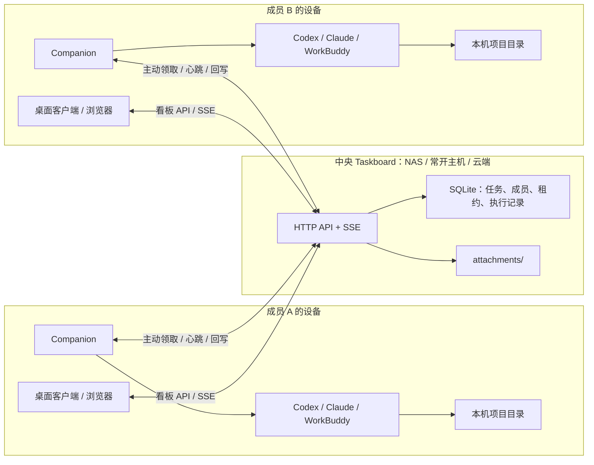

# 设计：10 人以下团队的轻量多人协作

状态：**讨论中；作为后续实现的设计基线，尚未进入代码实施。**
版本：v0.2
日期：2026-08-15

---

## 1. 目标与结论

本方案面向家庭或 10 人以下的可信小团队，解决三件事：

1. 一位成员把任务分配给另一位成员；
2. 任务负责人补充定义、约束和验收标准，再委派给自己的 Agent；
3. 多人共享看板、评论和执行进度，但不共享应用、源码、项目目录和 Agent 凭证。

首版固定采用以下设计：

- 由一个中央 Taskboard 服务保存唯一的看板业务数据；
- NAS 可以承载中央服务，但不能只作为多台电脑共同打开 SQLite 的共享文件夹；
- iCloud Drive、Synology Drive、Dropbox、OneDrive 等同步盘只用于备份和导出，不同步运行中的数据库；
- 任务拆成“人类负责人”和“执行 Agent”两个维度，不再把人和 Agent 混在同一个负责人字段中；
- 执行 Agent 可为空；一旦设置，只能属于当前负责人；
- 任务详情使用短时编辑租约，同一时刻只允许一个客户端编辑，其他成员仍可评论；
- 不做可配置 RBAC，只保留成员身份、部署所有者和几条固定规则；
- 每位成员电脑上的 Companion 主动领取任务并启动本机 Agent，中央服务不反向控制成员电脑。

## 2. NAS 和 iCloud：同样能存文件，但不是同一种运行方式

### 2.1 真正的区别是“谁在运行数据库”

NAS 和 iCloud 都能保存、共享或同步文件，但对本项目来说要区分两种完全不同的拓扑：

```text
文件共享模式：多台电脑分别打开数据库文件
中央服务模式：只有一个服务打开数据库，其他设备调用 API
```

如果群晖或家用 NAS 只是提供 SMB/NFS/Synology Drive 文件夹，让几台电脑分别运行 Taskboard 并打开其中的 `taskboard.sqlite`，它与 iCloud Drive 属于同一类方案，均不采用。

如果 NAS 自己运行唯一的 Taskboard 服务，SQLite 位于该 NAS 的本地持久卷，其他设备只通过 HTTP/API 访问，那么 NAS 就是推荐的中央服务方案。SQLite 官方也建议跨网络使用时，让数据库与唯一读写它的进程位于同一台机器，远程客户端通过代理/API 访问，而不是直接打开网络数据库文件。[SQLite over a network](https://www.sqlite.org/useovernet.html)

### 2.2 NAS 是否可用的判断表

| NAS 能力 | 能否作为中央服务 | 处理方式 |
|---|---:|---|
| 能运行 Docker/Container Manager，能挂载本地持久卷并开放端口 | 能 | 推荐，部署 Taskboard 容器 |
| 能稳定运行 Node.js 22.5+ 服务并设置开机重启 | 能 | 可用，但维护成本高于容器 |
| 只能提供 SMB/NFS/同步盘共享 | 不能 | 只保存备份；服务改跑在常开电脑或小主机上 |
| 能运行服务，但数据库卷实际挂载自另一台网络设备 | 不采用 | 数据库改放服务所在机器的本地卷 |

群晖中支持 Container Manager 的型号可以按容器方案落地；不同型号和 DSM 版本的套件兼容性不同，应在目标机器的套件中心和产品规格中确认。Container Manager 本身支持项目、端口、卷、环境变量和重启配置。[Synology Container Manager](https://kb.synology.com/en-us/DSM/help/ContainerManager/docker_project)

如果家用 NAS 不支持容器，推荐的退路是：

```text
成员客户端 ──HTTP──> 常开的 Mac mini / NUC / 家庭服务器
                              ├─ 本机 SQLite + attachments
                              └─ 定时把一致性备份写入 NAS
```

不要让服务跑在小主机、运行库却通过 SMB 放在 NAS 上；这仍然是网络数据库文件。

### 2.3 iCloud 的正确用途

iCloud Drive 的文件变化是异步同步；同步时间受联网状态和网络速度影响。多台离线设备修改同一文档时还可能形成冲突版本，需要选择或手工合并。[iCloud Drive 同步说明](https://support.apple.com/en-gb/109344)、[冲突版本说明](https://support.apple.com/en-gb/guide/mac-help/mh40780/26/mac/26)

因此 iCloud 只用于：

- 保存已经生成完毕的不可变备份包；
- 保存导出文件，供迁移或人工归档；
- 保存恢复说明和备份清单。

不用于：

- 同步运行中的 `taskboard.sqlite`、`-wal` 和 `-shm`；
- 同步运行中的 `attachments/` 与数据库变更；
- 让两台设备轮流打开同一同步目录中的主库。

## 3. 可借鉴的上游与前沿产品

### 3.1 dashi-taskboard 上游

上游当前的 Cloudflare 协作方案已经验证了两个重要边界：

- D1 是唯一业务数据源，R2 存附件，不与本地 SQLite 双写或自动合并；
- 项目的绝对路径、Git/worktree、Skill/MCP 和 Agent 能力由各设备的本地 Companion 保留。

这部分直接沿用为本设计的“中央业务数据 + 设备本地执行环境”边界。上游仍是面向两位可信协作者的共享密码模型，用户名只用于展示，不能作为稳定成员身份，因此不能直接满足本方案的任务负责人和个人 Agent 归属。[上游 Cloud collaboration](https://github.com/chuspeeism/dashi-taskboard/blob/main/docs/cloud-collaboration.md)

### 3.2 Multica

Multica 当前采用中央后端、数据库和成员机器上的 Agent daemon：daemon 在代码旁运行，发现本机 Agent CLI，领取任务并回写进度；Agent 完成后把任务交回人工 review。这个“中央协调、执行留在成员机器、执行记录挂在同一任务上”的结构值得采用。[Multica README](https://github.com/multica-ai/multica)、[Self-hosting](https://github.com/multica-ai/multica/blob/main/SELF_HOSTING.md)

本项目不照搬 Multica 的 PostgreSQL、复杂工作区、RBAC、20 种运行时和完整执行日志，而只取最小闭环：

- 稳定成员；
- 设备注册和心跳；
- 当前负责人自己的 Agent；
- Agent 执行请求、租约和结果；
- 人工验收后才完成任务。

## 4. 总体架构



架构规则：

1. 中央服务是共享业务数据的唯一权威来源；
2. 浏览器或桌面客户端不直接访问数据库文件；
3. Companion 只主动向外连接，不要求 NAS 反向连接成员电脑；
4. 源码、worktree 和 Agent 凭证不上传中央服务；
5. 断网时可以读取最近缓存，但首版不允许离线写入和稍后合并。

## 5. 任务角色模型

### 5.1 采用“人类负责人 + 执行 Agent”

这个拆法合理，但 UI 中不建议把 Agent 称为“执行人”，而应明确显示：

- **负责人：** 一个真实成员；负责定义、约束、判断和验收；
- **执行 Agent：** 负责人的 Codex、Claude 或 WorkBuddy；负责具体执行；可为空。

示例：

```text
负责人：张三
执行 Agent：张三的 Codex
```

任务可以只有负责人而没有执行 Agent，例如线下沟通、采购、家庭事务和必须由人完成的工作。因此数据类型是“负责人可为空，执行 Agent 也可为空；若存在执行 Agent，则必须存在负责人”。

### 5.2 为什么不继续使用一个 assignee 字段

当前实现把本地用户和全局 Codex/Claude/WorkBuddy 都放在 `assignee` 中，这会丢失一个关键事实：到底是哪位成员对任务负责、又是谁授权自己的 Agent 执行。

目标模型改为：

```ts
type TaskResponsibility = {
  responsibleMemberId: string | null;
  executorAgentKind: "codex" | "claude" | "workbuddy" | null;
};
```

首版不需要给每个 Agent 单独建“员工账号”。Agent 的完整身份由下列组合得到：

```text
任务负责人 member_id + executor_agent_kind
```

服务端必须验证 `executorAgentKind` 是当前负责人某台在线或已注册设备声明支持的 Agent 类型。执行请求再记录实际运行设备，避免把任务角色与某台电脑永久绑定。

### 5.3 固定操作规则，不做可配置 RBAC

| 操作 | 固定规则 |
|---|---|
| 查看任务、评论 | 所有有效成员 |
| 编辑任务定义、状态和关系 | 任一有效成员取得编辑租约后 |
| 设置或更换负责人 | 任一有效成员取得编辑租约后；记录操作者 |
| 选择、启动或取消执行 Agent | 仅当前负责人 |
| Agent 写过程和结果 | 仅对应执行请求使用的设备令牌 |
| 邀请、停用成员 | 仅部署所有者 |

“部署所有者”只是这个私有实例的安装和成员管理者，不参与项目级权限判断。首版没有项目管理员、访客、字段权限、审批权限等角色。

### 5.4 负责人变化时的行为

- 没有执行中的 Agent：立即更换负责人，并清空 `executorAgentKind`；
- 有 `queued` 执行：先取消该执行，再更换负责人；
- 有 `claimed` 或 `running` 执行：拒绝更换并返回 `409 ACTIVE_AGENT_RUN`；负责人先显式取消或等待结束；
- 历史执行记录保留原负责人快照，不随任务当前负责人改变；
- 新负责人需要重新选择自己的 Agent，旧负责人的 Agent 不会自动转移。

这条规则保证负责人不能直接启动或继承另一位成员电脑上的 Agent。

## 6. 成员、设备与登录

### 6.1 首版成员模型

成员表只需要：稳定 ID、显示名、头像、状态和时间戳。显示名可以修改，但成员 ID 不变。评论、编辑锁、负责人和执行记录都引用成员 ID，而不是相信浏览器传入的用户名。

首次启动时创建一个部署所有者。后续加入流程：

1. 部署所有者创建一次性邀请码；
2. 邀请码默认 24 小时过期，只能使用一次；
3. 新成员设置显示名并获得浏览器会话；
4. 安装本地客户端或 Companion 后，用同一成员身份注册设备；
5. 部署所有者可以停用成员，服务端同时撤销其浏览器和设备会话。

### 6.2 会话形式

- 浏览器：`HttpOnly + SameSite=Lax` Cookie；HTTPS 下强制 `Secure`，只在回环地址或明确启用的可信局域网 HTTP 模式下省略；
- Companion：随机设备令牌，系统钥匙串优先，无法使用时存入权限为 `0600` 的设备配置；
- 服务端：只存令牌哈希，不存明文；
- 局域网纯 HTTP 只适合可信 LAN；跨公网必须使用 HTTPS，推荐 VPN/Tailscale 或认证反向代理。

### 6.3 设备注册

每台 Companion 注册：

- `deviceId`、设备名和所属成员；
- 支持的 Agent 类型；
- 本机已映射的项目 ID；
- 是否允许自动执行；
- 最近心跳和客户端版本。

中央服务不存绝对项目路径，只存“该设备是否具备项目映射”。绝对路径继续保存在该设备的 Companion 配置中。

## 7. 数据模型与迁移

以下是目标表结构，字段名用于约束后续实现；时间统一保存为 UTC ISO 字符串。

### 7.1 新表

```sql
CREATE TABLE members (
  id TEXT PRIMARY KEY,
  display_name TEXT NOT NULL,
  avatar_url TEXT,
  status TEXT NOT NULL CHECK (status IN ('active', 'disabled')),
  is_deployment_owner INTEGER NOT NULL DEFAULT 0,
  created_at TEXT NOT NULL,
  updated_at TEXT NOT NULL
);

CREATE TABLE member_invites (
  id TEXT PRIMARY KEY,
  token_hash TEXT NOT NULL UNIQUE,
  created_by_member_id TEXT NOT NULL REFERENCES members(id),
  expires_at TEXT NOT NULL,
  used_at TEXT,
  created_at TEXT NOT NULL
);

CREATE TABLE member_sessions (
  id TEXT PRIMARY KEY,
  member_id TEXT NOT NULL REFERENCES members(id),
  kind TEXT NOT NULL CHECK (kind IN ('browser', 'device')),
  device_id TEXT REFERENCES devices(id),
  token_hash TEXT NOT NULL UNIQUE,
  expires_at TEXT,
  revoked_at TEXT,
  last_seen_at TEXT NOT NULL,
  created_at TEXT NOT NULL
);

CREATE TABLE devices (
  id TEXT PRIMARY KEY,
  member_id TEXT NOT NULL REFERENCES members(id),
  name TEXT NOT NULL,
  capabilities_json TEXT NOT NULL,
  mapped_project_ids_json TEXT NOT NULL,
  execution_enabled INTEGER NOT NULL DEFAULT 1,
  last_seen_at TEXT NOT NULL,
  created_at TEXT NOT NULL,
  updated_at TEXT NOT NULL
);

CREATE TABLE task_edit_leases (
  task_id TEXT PRIMARY KEY REFERENCES tasks(id) ON DELETE CASCADE,
  member_id TEXT NOT NULL REFERENCES members(id),
  client_instance_id TEXT NOT NULL,
  lease_id TEXT NOT NULL UNIQUE,
  token_hash TEXT NOT NULL,
  base_version INTEGER NOT NULL,
  expires_at TEXT NOT NULL,
  updated_at TEXT NOT NULL
);

CREATE TABLE agent_runs (
  id TEXT PRIMARY KEY,
  task_id TEXT NOT NULL REFERENCES tasks(id),
  responsible_member_id TEXT NOT NULL REFERENCES members(id),
  agent_kind TEXT NOT NULL CHECK (agent_kind IN ('codex', 'claude', 'workbuddy')),
  target_device_id TEXT NOT NULL REFERENCES devices(id),
  status TEXT NOT NULL CHECK (
    status IN ('queued', 'claimed', 'running', 'succeeded', 'failed', 'canceled', 'interrupted')
  ),
  claim_token_hash TEXT,
  claim_expires_at TEXT,
  session_id TEXT,
  result_summary TEXT,
  error_code TEXT,
  created_at TEXT NOT NULL,
  claimed_at TEXT,
  started_at TEXT,
  finished_at TEXT,
  updated_at TEXT NOT NULL
);

CREATE TABLE agent_run_events (
  id TEXT PRIMARY KEY,
  run_id TEXT NOT NULL REFERENCES agent_runs(id) ON DELETE CASCADE,
  kind TEXT NOT NULL,
  summary TEXT NOT NULL,
  created_at TEXT NOT NULL
);
```

`agent_run_events` 首版只保存结构化摘要、阻塞、完成和错误，不保存完整终端流、模型思考或所有工具调用，避免把 Taskboard 变成重型观测平台。

### 7.2 tasks 表调整

```sql
ALTER TABLE tasks ADD COLUMN responsible_member_id TEXT REFERENCES members(id);
ALTER TABLE tasks ADD COLUMN executor_agent_kind TEXT;
ALTER TABLE tasks ADD COLUMN created_by_member_id TEXT REFERENCES members(id);
```

服务端增加检查：

- `executor_agent_kind IS NULL OR responsible_member_id IS NOT NULL`；
- Agent 类型必须来自共享 Agent 注册表；
- 设置执行 Agent 的当前会话成员必须等于 `responsible_member_id`；
- 当前负责人至少有一台设备声明支持该 Agent，创建执行请求时还要有项目映射。

### 7.3 现有 assignee 数据迁移

迁移脚本按下列确定性规则执行：

1. 为现有 `creator_type=user`、`assignee_type=user` 和评论用户建立成员占位记录；
2. 原 `assignee_type=user`：迁移为 `responsible_member_id`，执行 Agent 为空；
3. 原 `assignee_type=agent`：负责人取任务的人类创建者；创建者不是人类时取部署所有者；Agent ID 映射为 `executor_agent_kind`；
4. 原 actor 快照暂时保留，保证旧客户端和历史展示可回退；
5. 一个兼容版本后，确认所有读写都使用新字段，再删除旧 `assignee_*` 字段。

迁移必须可重复执行，并在事务中完成；迁移前生成一致性备份。

## 8. 任务详情排他编辑

### 8.1 首版直接采用编辑租约

中央服务存在时可以可靠实现“一个人编辑，其他人不可编辑”，因此本设计不再把“仅负责人编辑”作为默认方案。

流程：

1. 打开详情页只读，不占锁；
2. 点击“编辑”时调用租约接口；
3. 成功后整张任务进入编辑态，服务返回租约令牌、`baseVersion` 和过期时间；
4. 持有者每 30 秒续租，租约有效期 90 秒；
5. 保存请求必须同时携带租约令牌和当前任务 `version`；
6. 保存、取消或关闭编辑态时释放；崩溃、休眠或断网后最多 90 秒自动释放；
7. 其他客户端通过 SSE 收到锁状态，只读展示“张三正在编辑”，评论区继续可用。

同一成员的第二个标签页也视为另一个客户端，不自动共享编辑权，避免两个草稿互相覆盖。

### 8.2 锁定范围

需要租约：

- 标题、描述、负责人、执行 Agent、优先级、标签和日期；
- 开发上下文、任务关系、归档和恢复；
- 状态修改，包括详情页选择和看板拖动。

不需要租约：

- 查看任务、附件、活动和执行状态；
- 新增评论；
- 修改或删除自己的评论，仍使用评论自身的 `version`；
- 给自己的评论增加附件。

Agent 第一版不改写标题、描述、负责人和约束。Agent 只通过专用执行接口写运行状态、评论和任务生命周期建议。

### 8.3 服务端事务规则

申请租约时在事务中：

1. 删除该任务已过期的租约；
2. 如果仍有租约，返回 `423 TASK_EDIT_LOCKED`，包含持有成员和过期时间；
3. 写入新租约，只把明文令牌返回客户端，数据库只存哈希。

保存时在同一事务中验证：

1. 当前成员、客户端实例和令牌匹配；
2. 租约尚未过期；
3. 请求 `version` 等于数据库当前版本；
4. 更新任务并递增 `version`；
5. 成功后释放租约并广播任务与租约事件。

租约改善交互，现有 `version` 乐观并发控制继续作为最终一致性保护。无租约、租约过期或令牌不匹配返回 `423`；版本过期仍返回 `409 VERSION_CONFLICT`。

### 8.4 Agent 与人类编辑冲突

Agent 的 `queued/running/succeeded` 属于执行记录，不受任务编辑租约影响。Agent 想把任务移入 `in_progress` 或 `in_review` 时：

- 无人编辑：按最新 `version` 正常更新；
- 有人编辑：等待租约释放后重新读取任务并尝试一次；
- 人类已把任务移到其他状态或版本语义已变化：不覆盖，改为写一条系统评论提示“执行已完成，建议进入待验收”。

`done` 永远由用户明确验收后设置，Agent 不能直接完成任务。

## 9. API 设计

现有任务、评论、附件和 SSE API 保留；新增下列端点。

### 9.1 身份与成员

| 方法 | 路径 | 用途 |
|---|---|---|
| `GET` | `/api/session` | 当前成员与部署信息 |
| `GET` | `/api/members` | 有效成员列表 |
| `POST` | `/api/member-invites` | 部署所有者创建一次性邀请码 |
| `POST` | `/api/auth/join` | 使用邀请码加入并创建浏览器会话 |
| `POST` | `/api/auth/logout` | 注销当前会话 |
| `POST` | `/api/members/:id/disable` | 停用成员并撤销会话 |

### 9.2 任务负责人和执行 Agent

现有 `PATCH /api/tasks/:id` 增加 `responsibleMemberId`，仍要求 `version + editLeaseToken`。

执行 Agent 使用专用接口，避免普通编辑绕过“只有负责人能委派”的规则：

| 方法 | 路径 | 用途 |
|---|---|---|
| `PUT` | `/api/tasks/:id/executor` | 负责人选择自己的 Agent；要求任务租约 |
| `DELETE` | `/api/tasks/:id/executor` | 负责人取消执行 Agent；要求任务租约 |
| `POST` | `/api/tasks/:id/agent-runs` | 负责人创建一次执行请求 |
| `POST` | `/api/agent-runs/:id/cancel` | 负责人取消排队或请求停止执行 |

创建执行请求时服务端验证：任务负责人、Agent 类型、设备归属、项目映射和是否已有活动执行。

### 9.3 编辑租约

| 方法 | 路径 | 用途 |
|---|---|---|
| `POST` | `/api/tasks/:id/edit-lease` | 申请租约 |
| `PATCH` | `/api/tasks/:id/edit-lease` | 使用租约令牌续租 |
| `DELETE` | `/api/tasks/:id/edit-lease` | 保存或取消后释放 |

SSE 增加：`task.edit-lease-acquired`、`task.edit-lease-released`、`task.edit-lease-expired`。续租不广播，避免每 30 秒让所有客户端刷新。

### 9.4 设备与执行领取

| 方法 | 路径 | 用途 |
|---|---|---|
| `POST` | `/api/devices/register` | Companion 注册或换取设备会话 |
| `PATCH` | `/api/devices/:id/heartbeat` | 更新能力、项目映射和在线状态 |
| `GET` | `/api/agent-runs/next?wait=25` | 长轮询领取属于该设备的排队请求 |
| `POST` | `/api/agent-runs/:id/claim` | 原子认领并取得执行租约 |
| `PATCH` | `/api/agent-runs/:id/heartbeat` | 续租并更新最小进度 |
| `POST` | `/api/agent-runs/:id/events` | 写阻塞、摘要或会话引用 |
| `POST` | `/api/agent-runs/:id/complete` | 成功完成 |
| `POST` | `/api/agent-runs/:id/fail` | 失败结束 |

设备端用 Bearer 设备令牌认证。服务端从令牌确定成员和设备，不接受请求体冒充其他设备。

## 10. Agent 执行状态机

任务状态与 Agent 执行状态分离：

```text
任务：todo → in_progress → in_review → done
执行：queued → claimed → running → succeeded / failed / canceled / interrupted
```

执行流程：

1. 负责人选择 Agent；
2. 服务端查找负责人名下、支持该 Agent 且具备项目映射的设备；
3. 只有一台可用设备时自动选中；多台时使用成员的首选设备，没有首选则要求用户选择；无可用设备时不创建执行并返回 `409 NO_ELIGIBLE_DEVICE`；
4. 创建 `queued` 记录；目标 Companion 通过长轮询发现；
5. Companion 使用比较并交换方式认领，认领租约 60 秒，每 20 秒心跳；
6. Companion 启动本机 Agent，把 session/thread 引用写回执行记录；
7. Agent 通过已有 Taskboard Skill 读取最新任务和评论，过程只在需要沟通、阻塞或交付时写评论；
8. 完成后执行记录进入 `succeeded`，任务通常进入 `in_review`；失败则保留任务状态并写失败摘要；
9. 负责人验收后把任务移入 `done`。

避免重复执行的规则：

- 一个任务同一时刻最多一个 `queued/claimed/running` 执行；
- 认领和状态变化都在数据库事务中检查旧状态；
- 心跳过期后先标记 `interrupted`，不自动重跑；
- 人工点击“重试”创建新的 run，并引用上一个 run；
- 取消运行中的 Agent 是“请求取消”，只有 Companion 确认进程结束后才进入 `canceled`。

## 11. 共享数据与本机数据

### 11.1 共享业务数据

中央服务保存：

- 项目元数据，但不含设备绝对路径；
- 任务、评论、关系、附件和活动；
- 成员、邀请、会话哈希和设备公开能力；
- 负责人、执行 Agent 类型、执行状态和结果摘要；
- 编辑租约、任务版本和 SSE 变更序号。

### 11.2 设备本地数据

每台成员设备保留：

- 项目、仓库和 worktree 绝对路径；
- 源码、Git 状态和未提交修改；
- Agent 登录、Skill、MCP 和其他凭证；
- Companion 设备令牌；
- Codex/Claude/WorkBuddy 本地会话正文；
- `taskctl` shim、自动化策略、日志、缓存和临时文件。

## 12. 自定义数据存储位置

### 12.1 当前问题

当前 `CODEX_TASKBOARD_DATA_DIR` 同时承载 `taskboard.sqlite`、`attachments/`、`cloud-companion.json` 和生成的 `bin/taskctl`；Codex 用户目录与自动化策略又固定写在仓库 `.data` 中。这个目录混合了共享业务数据、设备凭证、生成文件和运行状态，不能整体同步或整体迁移。

### 12.2 目标目录和配置

```text
shared-data/                 # 只有中央服务读写
  taskboard.sqlite
  attachments/

device-data/                 # 每台成员设备独立
  companion.json
  automation-policies.json
  bin/
  client-profile/

runtime/                     # 可删除重建
  logs/
  cache/
  pids/
  codex-user-data/

backups/                     # 不可变备份包
  2026-08-15T120000Z/
    taskboard.sqlite
    attachments/
    manifest.json
```

新增配置：

| 配置 | 作用 |
|---|---|
| `TASKBOARD_SHARED_DATA_DIR` | 中央数据库和附件 |
| `TASKBOARD_DEVICE_DATA_DIR` | Companion 与客户端本机配置 |
| `TASKBOARD_RUNTIME_DIR` | 日志、缓存和运行状态 |
| `TASKBOARD_BACKUP_DIR` | 一致性备份输出，可选择 iCloud/NAS 同步目录 |

`CODEX_TASKBOARD_DATA_DIR` 在一个兼容版本内作为 `TASKBOARD_SHARED_DATA_DIR` 的旧别名；若新旧变量同时设置，启动时报错而不是猜测。

### 12.3 设置界面

桌面客户端分两种模式：

- **本地模式：** 设置中显示“看板数据位置”“备份位置”和“迁移数据”；
- **团队模式：** 只显示“团队服务器地址”“本机数据位置”和“备份由服务器管理”，不允许普通客户端选择中央数据目录。

NAS 容器通过持久卷设置共享数据位置，不在浏览器中把数据库迁到另一目录。

### 12.4 数据迁移流程

“迁移数据”不能直接拖动运行中的 `.data`：

1. 阻止新写入并等待当前事务结束；
2. 释放编辑租约，暂停 Agent 新认领；
3. 使用 SQLite Backup API 或 `VACUUM INTO` 生成一致性数据库；
4. 复制附件并生成大小和哈希清单；
5. 在目标目录执行 `PRAGMA integrity_check` 并核对附件；
6. 原子切换配置指针并重启服务；
7. 原目录保留为带时间戳的只读回退副本，用户确认后再自行删除。

## 13. NAS 部署规格

首版交付以下部署文件：

- 一个多阶段 `Dockerfile`，构建 Web 后以非 root 用户运行 Node 服务；
- `docker-compose.nas.yml`；
- `/var/lib/taskboard` 持久卷；
- 默认端口 `47823`；
- `/health` 健康检查；
- `restart: unless-stopped`；
- `TZ`、数据目录和初始所有者配置；
- 自动备份命令和恢复命令；
- 群晖 Container Manager 的图形化部署说明。

参考 Compose 形态：

```yaml
services:
  taskboard:
    image: ghcr.io/OWNER/agent-taskboard:VERSION
    restart: unless-stopped
    ports:
      - "47823:47823"
    environment:
      TASKBOARD_SHARED_DATA_DIR: /var/lib/taskboard
      TASKBOARD_BACKUP_DIR: /var/lib/taskboard-backups
      TZ: Asia/Shanghai
    volumes:
      - ./taskboard-data:/var/lib/taskboard
      - ./taskboard-backups:/var/lib/taskboard-backups
    healthcheck:
      test: ["CMD", "node", "scripts/healthcheck.mjs"]
      interval: 30s
      timeout: 5s
      retries: 3
```

部署要求：

- 数据卷必须是 NAS 自己的本地卷；
- 默认只在局域网或 VPN 内开放；
- 公网访问使用 HTTPS 反向代理，应用会话仍由 Taskboard 验证；
- 每天至少一次一致性备份，保留 7 个日备份和 4 个周备份；
- iCloud 可作为第二份异地备份，但不能是唯一备份。

## 14. UI 功能清单

### 14.1 成员与任务

- 首次启动的创建所有者向导；
- 成员邀请链接、有效期、停用和在线状态；
- 任务卡同时显示负责人头像和 Agent 小标识；
- 详情页分开显示“负责人”和“执行 Agent”；
- 负责人为空时显示“待分配”；
- 只有当前负责人看到“交给我的 Agent”“取消执行”和“重试”；
- 设备离线或项目未映射时显示具体原因和修复入口。

### 14.2 编辑锁

- 点击编辑后才申请租约；
- 被锁时字段、状态和关系入口只读；
- 顶部显示“张三正在编辑，预计 14:32 自动释放”；
- 评论输入框不受影响；
- 续租失败时立即退出编辑态，保留本地草稿并提供复制按钮，不自动覆盖服务端；
- 看板拖动先申请一次性租约，移动成功后立即释放；被锁任务回弹并显示持有者。

### 14.3 Agent 执行

- 显示排队、认领、运行、完成、失败、中断和取消；
- 展示实际执行设备、Agent、开始时间、耗时、会话引用和结果摘要；
- 不默认展示完整终端流；
- 任务进入 `in_review` 后突出显示“等待负责人验收”；
- Agent 阻塞时通知负责人，不向全团队广播每一步。

## 15. 代码改造落点

实现时按当前代码结构落到以下位置：

| 位置 | 主要改动 |
|---|---|
| `server/database.mjs` | 新表迁移、负责人字段、编辑租约事务、Agent run 原子状态变化 |
| `server/app.mjs` | 登录中间件、成员/设备/租约/run 路由、写接口租约校验、SSE 事件 |
| `server/auth.mjs`（新增） | 邀请码、Cookie/设备令牌、会话撤销 |
| `server/collaboration.mjs`（新增） | 固定协作规则、租约与成员校验 |
| `server/agent-runs.mjs`（新增） | 设备选择、领取租约、状态机和取消协议 |
| `shared/agents.mjs` | 继续作为 Agent 类型和能力注册表，不保存成员归属 |
| `web/src/types.ts` | Member、Device、TaskEditLease、AgentRun 和新任务字段 |
| `web/src/api.ts` | 新增身份、租约、设备和执行 API 客户端 |
| `web/src/components/TaskEditor.tsx` | 负责人/执行 Agent 拆分、编辑态与锁提示 |
| `web/src/components/TaskCard.tsx` | 人类负责人和执行 Agent 双展示 |
| `scripts/taskboard-companion.mjs`（新增） | 设备注册、长轮询、认领、启动 Agent、心跳和结果回写 |
| `src-tauri/` | 本地/团队模式、服务器地址和数据位置设置 |

Cloudflare 适配器不是 NAS 首版前置条件。先把协作领域规则放在数据库无关的服务层，再为 D1 增加等价实现，避免 SQLite 和云端各写一套不同规则。

## 16. 分阶段实施与验收

### 阶段 1：拆分数据目录

实现：四类目录、新旧环境变量兼容、迁移与备份命令。

验收：修改共享数据位置不会带走设备令牌和 Codex 用户目录；一致性备份可在空目录恢复。

### 阶段 2：稳定成员与任务双角色

实现：成员、邀请、会话、任务负责人和执行 Agent 字段；迁移旧 assignee。

验收：两位成员能分别登录；A 能把任务负责人设为 B；只有 B 能选择“B 的 Codex”；旧任务内容和历史评论不丢失。

### 阶段 3：排他编辑

实现：编辑租约表、API、SSE 和 UI 只读态。

验收：两个独立浏览器同时打开同一任务时只有一个能编辑；断网后 90 秒可接管；被锁成员始终能评论；旧版本保存仍返回 `VERSION_CONFLICT`。

### 阶段 4：设备与 Agent 执行闭环

实现：Companion 注册/心跳、项目能力、run 状态机、长轮询领取和取消。

验收：A 不能启动 B 的 Agent；B 委派后只有 B 的目标设备能认领；断线不会双重执行；成功进入 `in_review`，必须由人验收进入 `done`。

### 阶段 5：NAS 容器化

实现：镜像、Compose、健康检查、群晖说明、备份恢复。

验收：群晖或普通 Docker 主机重启后服务和数据恢复；客户端只配置服务器地址；数据库未被同步盘或远程文件系统直接打开。

### 阶段 6：云端等价能力

实现：把成员、租约、设备和 run 规则移植到 Cloudflare/D1。

验收：NAS 与云端的客户端行为一致；不存在本地与云端双写；切换模式不会自动合并两个权威数据源。

## 17. 首版明确不做

- 项目级 RBAC、访客和自定义权限矩阵；
- Google Docs 式逐字符协同编辑或 CRDT；
- 离线写入、自动合并和多主同步；
- 负责人远程控制成员电脑；
- 同步应用、源码、Git/worktree、Skill、MCP 和 Agent 凭证；
- 自动重跑中断任务或跨设备故障转移；
- 完整终端录像、模型思考保存和成本分析平台；
- 同一任务同时运行多个 Agent。

## 18. 后续仍需确认的产品参数

以下不会改变总体架构，可以在实施相应阶段前确定：

1. 首版是否同时支持 Codex、Claude、WorkBuddy，还是先只打通 Codex；
2. 成员头像先用首字母还是允许上传图片；
3. 备份是否默认加密，以及密钥由系统钥匙串还是部署所有者保管；
4. 桌面客户端是否提供只读离线缓存；本稿默认无网络时显示最后一次数据并明确标记过期；
5. 群晖首批实际验证的 DSM 版本与 CPU 架构。

## 19. 修订记录

- 2026-08-14 v0.1：确立 NAS 中央服务、排除 iCloud 运行库同步、提出编辑租约，并拆分共享业务数据、设备本地数据和备份。
- 2026-08-15 v0.2：升级为实施蓝图；明确 NAS 可用条件、人类负责人/执行 Agent、成员和设备模型、数据库表、API、租约事务、Agent 状态机、数据迁移、NAS 部署、代码落点和分阶段验收。
